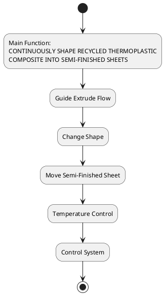

# Analysis of the Process

```plantuml
@startuml
skinparam defaultTextAlignment left

(*) --> "Main Function:
CONTINUOUSLY SHAPE RECYCLED THERMOPLASTIC
COMPOSITE INTO SEMI-FINISHED SHEETS"

--> "Guide Extrude Flow"

--> "Change Shape"

--> "Move Semi-Finished Sheet"

--> "Temperature Control"

--> "Control System"

--> (*)
@enduml
```
