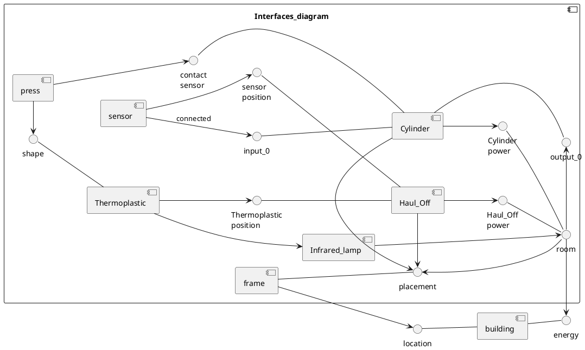

# Interfaces

```plantuml
@startuml 
skinparam backgroundColor transparent
left to right direction

component Interfaces_diagram {
    
    [frame]
    () placement -u- frame
    [Cylinder]
    () input_0 -- Cylinder
    () output_0 -- Cylinder
    () "contact\nsensor" -- Cylinder

    [sensor]
    sensor --> input_0 : connected
    sensor --> "sensor\nposition"
    
    Cylinder -> placement

    [Cylinder]
    () "Cylinder\npower" -- room
    () "Haul_Off\npower" -- room
   
    room -u-> placement
    Cylinder --> "Cylinder\npower"
    room -r-> output_0
    
    [Haul_Off]
    () "sensor\nposition" -- Haul_Off
    () "Thermoplastic\nposition" -- Haul_Off
    Haul_Off -> placement
    Haul_Off --> "Haul_Off\npower"

    [Thermoplastic]
    () shape -- Thermoplastic
    
    [press]
    press -l-> shape
    
    Thermoplastic --> "Thermoplastic\nposition"
    press --> "contact\nsensor"

    [Infrared_lamp]
    Infrared_lamp -> room
    Thermoplastic -->Infrared_lamp
}

[building]

() energy -l- building
() location -d- building

frame --> location
room -r-> energy

@enduml
```